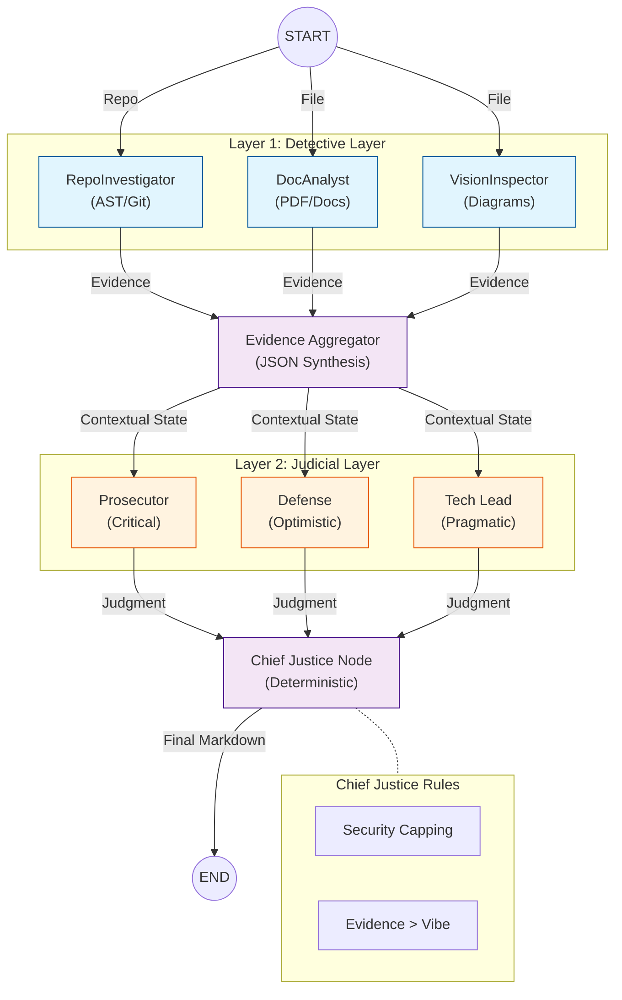

# Automaton Auditor Architecture

The Automaton Auditor is a deep multi-agent governance system built on a hierarchical LangGraph `StateGraph`. It follows a "Digital Courtroom" model using a three-layer orchestration.

## Architecture Diagram

## Key Architectural Principles

1.  **Hierarchical StateGraph**: The system utilizes LangGraph to manage complex state transitions and parallel execution branches.
2.  **Two-Layer Parallel Orchestration**: 
    - **Detective Layer**: Parallel forensic collection of objective facts.
    - **Judicial Layer**: Parallel dialectical analysis of facts through distinct personas.
3.  **Deterministic Synthesis**: The Chief Justice node uses hardcoded Python logic (Constitutional Rules) rather than another LLM prompt to ensure consistency and security adherence.
4.  **Typed State Management**: Uses Pydantic and `TypedDict` with state reducers (`operator.add`, `operator.ior`) to handle concurrent updates without data loss.
